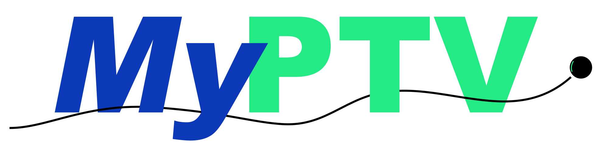

December 25, 2022
Version: 0.7.0

   

## About

MyPTV is an open source software designed for 3D particle Tracking Velocimetry (3D-PTV) measurements. In short, 3D-PTV is a method used to track the positions of particles in three dimensions, which is used extensively in fluid mechanics, biology and soft matter physics. The method relies on stereoscopic digital photography from calibrated cameras to infer particle's 3D positions and track their motion through time. 

 

MyPTV makes 3D particle tracking accessible to a wide range of scientists in two ways. First, we use the Python programming language, which is open source and accessible to the scientific, non-professional computer programmers, community. We believe that this accessibility to the inner workings of the code is essential for 3D-PTV to go into the future. Second, we attempt to keep the dependencies as few as possible and write as much of the code ourselves; this will help in maintaining the project for many years to come as Python keeps evolving. 

MyPTV builds heavily on the well-proven mathematical framework developed in the OpenPTV project (https://www.openptv.net/), and especially, the photogrammetry principles are the same [1]. The main difference is that the code is written in Python, thus making it accessible to a wider scientific community. Furthermore, MyPTV uses several new adaptations of the traditional algorithms that have been introduced in recent years, e.g. [2-6], and several novel algorithms that we are using were developed here.

## Who is MyPTV for?

MyPTV is designed to be used by scientists and engineers who need to track the the three dimensional motion of objects in lab and field experiments. Applications range from fluid mechanics to biology, soft matter, or medicine.  

## What is MyPTV capable of?

1) Combining images of particles from several orientations to give their 3D position
2) Calibrating cameras based on given input imaeges
3) Locating and extracting the locations of particles in images
4) Stereo-matching of numerous particles from 2D images
5) Tracking particles in 3D 
6) Tracking particles in 2D
7) Smoothing particle trajectories while calculating their velocities and accelerations
8) Re-connecting broken trajectories
9) Measuring the orientations of anisotropic particles in 3D (new from version 7.0.0 and on)

## How to install?

##### Requirements:

MyPTV requires you have Python 3 installed with pip, along with the Python packages: numpy, scipy, scikit-image, pandas, matplotlib, itertools

##### Installation:
###### Using `pip`

1) Open your terminal and change directory to the path of the code:

​	`cd path/to/myptv` 
​	
2) we use pip to install by using the following command: 

​	`pip install .`    or    `pip install -r .\requirements.txt`

3) Optionally, parts of the code can be tested using pytest:

​	`pytest ./tests/ -W ignore::RuntimeWarning`

###### Using `conda` 

1) Install Anaconda or Miniconda and from the command shell inside the directory
where the package is downloaded:

​	`conda env create -f environment.yml`

2) Activate the environment:

​	`conda activate myptv`

3) Install MyPTV in the new environment: 

​	`pip install .`

4) Optionally, parts of the code can be tested using pytest:

​	`pytest ./tests/ -W ignore::RuntimeWarning`

## How to start?

To setup MyPTV on your local machine, either clone or download this repository and install MyPTV using the instructions above. Then, you can find detailed using instructions in the Manual (see `/user_manual/user_manual.pdf`).

After the installation is done, you can import MyPTV in your python code as usual. For example:
	`import myptv.imaging_mod`
or 	
   `from myptv import imaging_mod`

## Community guidelines

MyPTV was founded in 2022 by Ron Shnapp. In its core, MyPTV is a scientific open source project and contributions are most welcome! 

1) Facing difficulties using of installing MyPTV? Want to share your new exciting results? Try posting a question on MyPTV's Discussion forum - https://github.com/ronshnapp/MyPTV/discussions. 

2) Do you wish to contribute to our effort by further developing of MyPTV? Would you like to help debugging and/or test the software? Please leave a post on our Discussion forum - https://github.com/ronshnapp/MyPTV/discussionscontact. 

3) Did you spot a bug? Would like to raise an issue? Please open an issue in our Github repositories' issues section - https://github.com/ronshnapp/MyPTV/issues.

In any case, if you feel the need - please feel free to send Ron an email directly (ronshnapp@gmail.com)!

## How to cite?

If you found MyPTV useful for your scientific work, you may cite us as:

Shnapp, R., (2022). MyPTV: A Python Package for 3D Particle Tracking. Journal of Open Source Software, 7(75), 4398, https://doi.org/10.21105/joss.04398 

See our paper on JOSS: https://joss.theoj.org/papers/10.21105/joss.04398#

## References

[1] Maas, H. G., Gruen, A., & Papantoniou, D. (1993). Particle tracking velocimetry in three-dimensional flows. *Experiments in fluids*, *15*(2), 133-146.

[2] Mann, J., Ott, S., & Andersen, J. S. (1999). *Experimental study of relative, turbulent diffusion*. Risø National Laboratory.

[3] Ouellette, N. T., Xu, H., & Bodenschatz, E. (2006). A quantitative study of three-dimensional Lagrangian particle tracking algorithms. *Experiments in Fluids*, *40*(2), 301-313.

[4] Schanz, D., Schröder, A., Gesemann, S., Michaelis, D., & Wieneke, B. (2013). Shake the box: a highly efficient and accurate tomographic particle tracking velocimetry (TOMO-PTV) method using prediction of particle positions.

[5] Shnapp, R., Shapira, E., Peri, D., Bohbot-Raviv, Y., Fattal, E., & Liberzon, A. (2019). Extended 3D-PTV for direct measurements of Lagrangian statistics of canopy turbulence in a wind tunnel. *Scientific reports*, *9*(1), 1-13.

[6] Bourgoin, M., & Huisman, S. G. (2020). Using ray-traversal for 3D particle matching in the context of particle tracking velocimetry in fluid mechanics. *Review of scientific instruments*, *91*(8), 085105.
